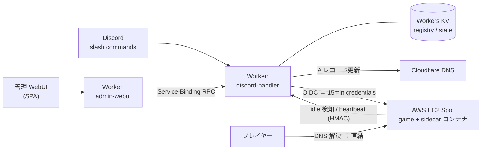

# game-servers

Discord コマンドから起動・停止できる、複数ゲーム対応の AWS Spot 型ゲームサーバー基盤。プレイ時間だけ課金される個人運用 OSS プロジェクト。

## アーキテクチャ



詳細な構成図とシーケンス図は [docs/architecture.md](docs/architecture.md) を参照。

| レイヤ | 採用技術 | 役割 |
|---|---|---|
| 制御プレーン | Cloudflare Workers + KV | Discord interaction の処理、ゲーム registry、ジョブ予約、Cron |
| 認証 | Worker 自身を OIDC issuer 化 → AWS IAM が信頼 | `AssumeRoleWithWebIdentity` で 15 分短期 credentials を発行、長期 IAM Access Key 不使用 |
| 実行プレーン | AWS EC2 Spot + EBS snapshot | Launch Template + 起動時 user-data でゲーム差を吸収、停止時は world を snapshot 化 |
| 自動停止 | sidecar コンテナ (ゲームと同 network namespace) | Minecraft RCON 等で idle 判定 → Worker に通知 → terminate + snapshot |
| ゲーム抽象化 | `games/<id>/registry.json` 駆動 | Worker / AMI / Terraform にゲーム名をハードコードしない |
| 管理 WebUI | admin-webui Worker (Svelte SPA + JSON API) | modpack 検索 (CurseForge proxy)、新規ゲーム追加、start/stop/status。AWS 操作は Service Binding RPC で discord-handler に委譲し、AWS 秘密鍵を持たない |
| 通知 | SNS → Worker `/aws/notification` → Discord Webhook | Spot 中断、ready 通知、コスト Budget アラートを Discord に集約 |
| IaC | Terraform (S3 backend + ネイティブロック) | AWS リソース定義、Phase 5 で手動運用から完全移行 |

## 設計のハイライト

- **コスト**: プレイ無しなら EC2 0 台。月 50 時間プレイで ¥700 / 月程度。Elastic IP も常時稼働 EC2 も持たない
- **registry 駆動**: 新ゲーム追加は `games/<id>/registry.json` の追加だけ。Worker / AMI の再ビルドゼロ
- **OIDC のみ**: Worker → AWS は短期 credentials のみで動作 (Phase 5 で静的 Access Key を完全廃止)
- **汎用 AMI 一個**: ゲーム差分は sidecar の adapter (`launcher/sidecar/src/adapters/`) と registry に閉じる
- **Spot 中断対応**: EventBridge → SNS → Worker → Discord で即時通知、world は停止時 snapshot で保全
- **多層認証**: Discord 署名検証、Worker → AWS の OIDC、Worker ↔ sidecar の HMAC、AWS API 内の最小権限 policy

## ステータス

Phase 0 (検証) から Phase 5 (IaC + OIDC) まで完了、本番稼働中。Phase 7 (modpack 管理 WebUI) は実装完了・デプロイ検証中。各 Phase の実装計画と決定記録は `docs/phase*-plan.md` / `docs/phase7-modpack-webui.md` に保管。

## ドキュメント

| 区分 | ファイル | 内容 |
|---|---|---|
| 設計 | [docs/design.md](docs/design.md) | 全体設計、アーキテクチャ、コスト試算、Phase 計画 |
| 設計 | [docs/architecture.md](docs/architecture.md) | 構成図 (Mermaid: 全体構成 + 起動 / 停止 / WebUI シーケンス) |
| ADR | [docs/adr/0001](docs/adr/0001-cloudflare-workers-over-lambda.md) | Cloudflare Workers を Lambda より優先した理由 |
| ADR | [docs/adr/0002](docs/adr/0002-mc-stop-flow-docker-ssm.md) | Minecraft 停止フローを Docker + SSM で実装する判断 |
| ADR | [docs/adr/0003](docs/adr/0003-magic-link-auth.md) | WebUI 認証を Discord `/panel` 起点の magic link にした判断 |
| ADR | [docs/adr/0004](docs/adr/0004-admin-webui-separate-worker.md) | admin-webui を別 Worker に分離した判断 |
| 計画 | [docs/iac-migration-plan.md](docs/iac-migration-plan.md) | 手動コンソール → Terraform 移行の Step 0〜8 |
| 計画 | [docs/phase2-plan.md](docs/phase2-plan.md) 〜 [phase5-plan.md](docs/phase5-plan.md) | 各 Phase の実装計画と決定記録 |
| 計画 | [docs/phase7-modpack-webui.md](docs/phase7-modpack-webui.md) | Phase 7 modpack 管理 WebUI の設計・実装計画 |
| 運用 | [docs/runbook.md](docs/runbook.md) | Phase 0 検証手順 |
| 運用 | [docs/runbook-phase1.md](docs/runbook-phase1.md) / [-phase1-production.md](docs/runbook-phase1-production.md) | Phase 1 ローカル開発 / 本番デプロイ |
| 運用 | [docs/runbook-phase3-sidecar.md](docs/runbook-phase3-sidecar.md) | Sidecar + AMI 構築手順 |
| 運用 | [docs/runbook-phase4-notifications.md](docs/runbook-phase4-notifications.md) | SNS 通知経路の構築 |
| 運用 | [docs/runbook-phase5-oidc.md](docs/runbook-phase5-oidc.md) | OIDC cutover / 鍵 rotation / 緊急対応 |
| 運用 | [docs/runbook-phase7-deploy.md](docs/runbook-phase7-deploy.md) | Phase 7 WebUI のデプロイ手順 |
| 検証 | [docs/phase0-results.md](docs/phase0-results.md) | Phase 0 計測結果 (起動時間 / TPS / mspt / RSS) |
| 規約 | [docs/conventions.md](docs/conventions.md) | コードベース作業時の命名・秘密情報・設計上の制約 |

## ディレクトリ構成

| パス | 役割 | 主な言語 |
|---|---|---|
| `docs/` | 設計書・運用手順・ADR | Markdown |
| `workers/` | Cloudflare Workers (discord-handler: Discord bot + AWS 呼び出し + OIDC issuer / admin-webui: 管理 WebUI) | TypeScript |
| `admin-ui/` | 管理 WebUI の SPA (admin-webui Worker が配信) | Svelte + Vite |
| `packages/` | Worker 間で共有する型・契約 (`@gs/shared`) | TypeScript |
| `infra/` | AWS リソース定義 | Terraform |
| `ami/` | EC2 AMI ビルド定義 (sidecar 同梱) | Packer (HCL) |
| `launcher/` | ゲームコンテナ Dockerfile + sidecar | bash / TypeScript |
| `games/` | ゲーム別定義 (registry.json + config) | JSON / 各ゲーム固有 |
| `scripts/` | 開発・運用スクリプト (ゲーム登録、OIDC 鍵生成、AMI ビルド等) | bash / TS / PowerShell |

## 動かしてみる

依存:

- Node.js 22 LTS / pnpm 9.x / Terraform 1.10+ / Packer 1.11+ / Wrangler 3.x / AWS CLI v2
- AWS リージョン: `ap-northeast-1`

```bash
pnpm install
pnpm --filter discord-handler test    # Worker ユニットテスト
pnpm --filter admin-webui test        # 管理 WebUI Worker のユニットテスト
```

実際にデプロイする場合は、`workers/{discord-handler,admin-webui}/wrangler.toml` / `infra/envs/prod/{backend,tfstate,network,variables}.tf` / `games/atm11/registry.json` の placeholder を自分の環境の値 (AWS account、Cloudflare zone、Discord App など) に置き換える必要があります。手順は各 runbook を参照。

## ライセンス

[MIT License](LICENSE)

---

このプロジェクトは [Claude Code](https://claude.com/claude-code) (Anthropic) の支援を受けて開発しました。
