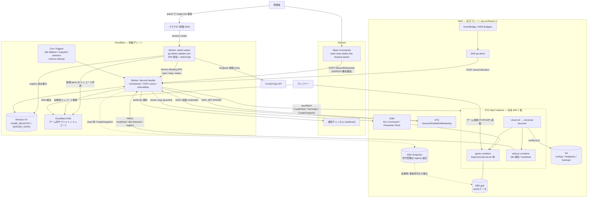
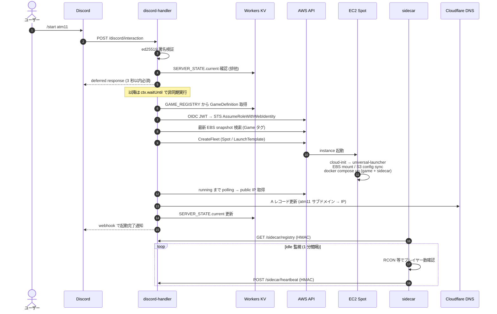
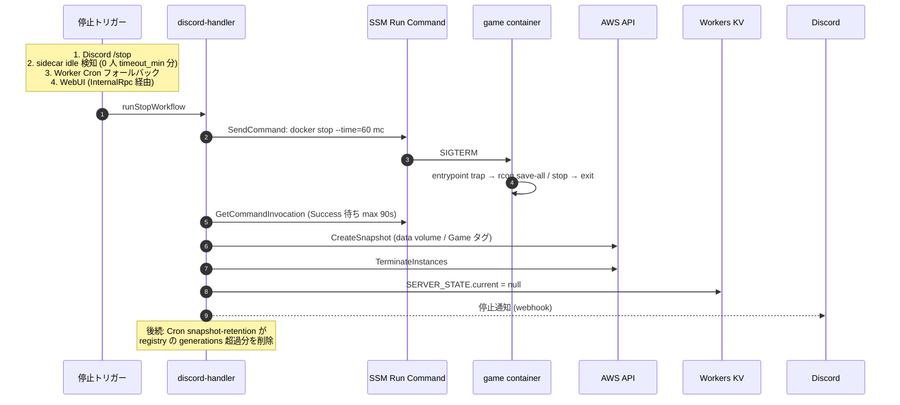
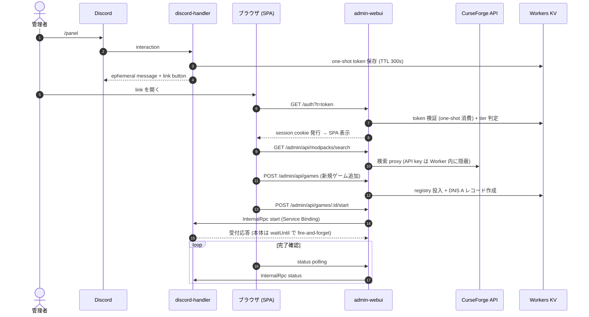

# アーキテクチャ図

最終更新: 2026-06-11 (Phase 7 E-2 時点、branch `phase7-webui`)

システムの全体像と主要フローを Mermaid で図示する。設計の背景・判断理由は
`docs/design.md` と `docs/adr/` を参照。

## 1. 全体構成

制御プレーン = Cloudflare Workers、実行プレーン = AWS EC2 Spot。
AWS への認証は OIDC (長期キーなし)、AWS/OIDC 秘密鍵は discord-handler のみが持ち、
admin-webui は Service Binding RPC で操作を委譲する。

補足:

- AWS IAM 側に OIDC provider を置き、discord-handler 自身が JWKS endpoint を公開する
  issuer を兼ねる (trust policy condition は `aud` + `sub`)。長期 Access Key は存在しない。
- ゲーム固有ロジックは Worker に置かず、KV の `GAME_REGISTRY` (source of truth は
  `games/<id>/registry.json`) と sidecar 内 adapter に閉じる。
- Elastic IP は使わず、起動のたびに public IP を取得して DNS A レコードを更新する。

## 2. 起動シーケンス (`/start <game>`)

## 3. 停止シーケンス (4 トリガー共通の `runStopWorkflow`)

ゲーム別の graceful stop コマンドは container 内 `entrypoint.sh` の trap に閉じており、
Worker は常に `docker stop` を発行するだけでよい (ADR 0002)。

## 4. 管理 WebUI フロー (Phase 7)

認証は Discord `/panel` 起点の magic link (one-shot token、TTL 300s、ephemeral 応答)。
AWS 操作は admin-webui からは行わず、Service Binding 経由の InternalRpc で
discord-handler に委譲する (外部 URL からは到達不可)。

## 関連ドキュメント

- `docs/design.md` — 全体設計・コスト試算・フェーズ計画
- `docs/adr/0002-mc-stop-flow-docker-ssm.md` — 停止フローの Docker + SSM 化
- `docs/adr/0003`〜`0004` — WebUI 認証 / Worker 分離の判断
- `docs/runbook-phase5-oidc.md` — OIDC 運用手順
